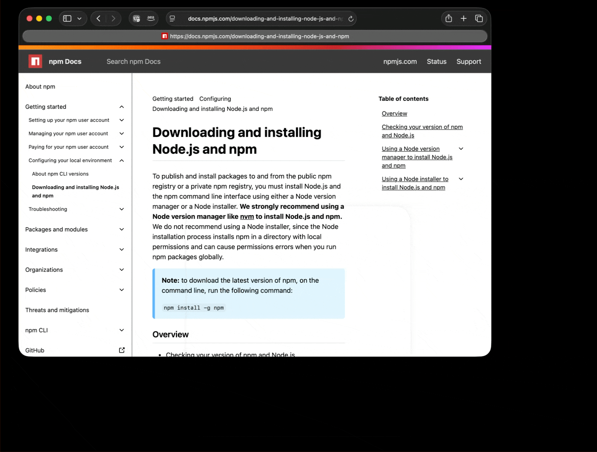
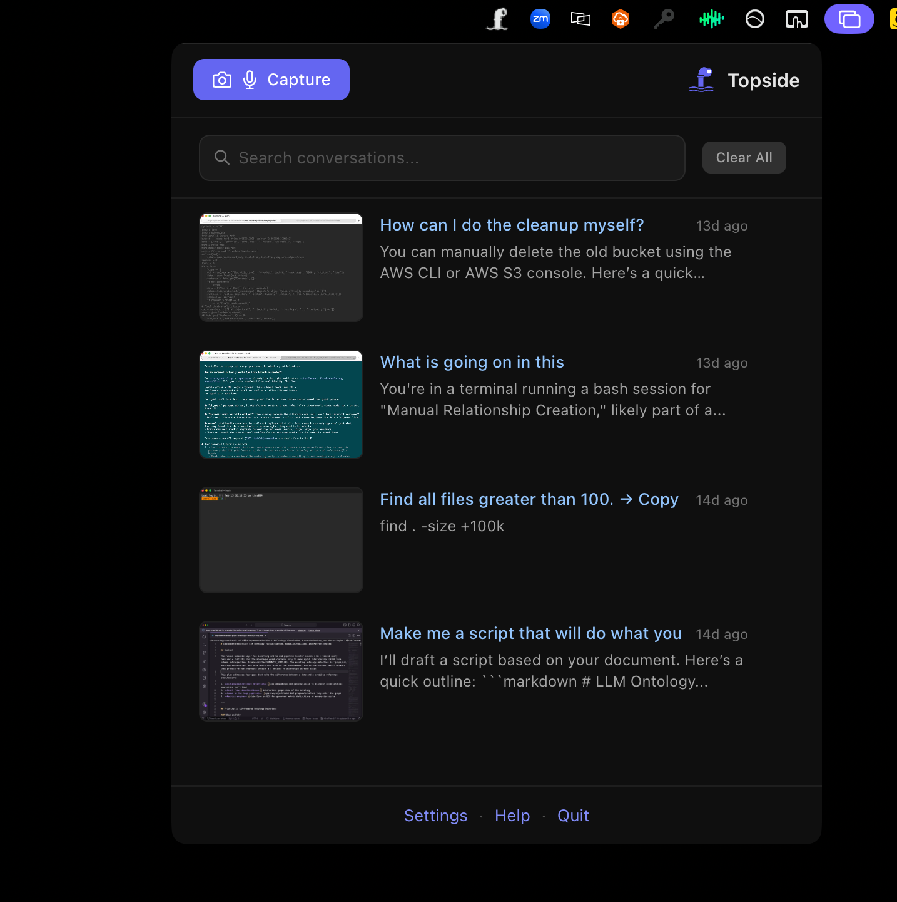
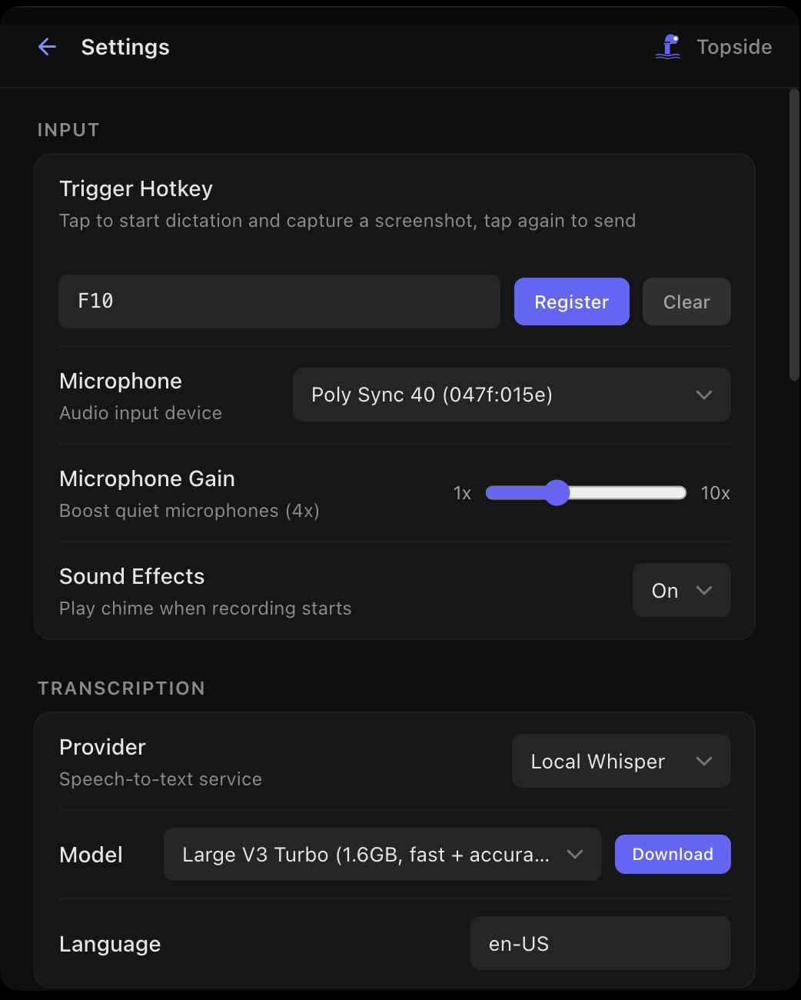

# Topside

Voice-to-AI desktop assistant for macOS.

Topside is a persistent conversational overlay that lets you talk to AI models using your voice. It sits on top of your desktop, ready to transcribe speech, send it to your AI provider, and display responses — all without switching windows.

<p align="center">
  
</p>

## Features

- **Voice input** — press a hotkey to record, release to transcribe (Whisper, local)
- **Multi-provider AI** — Amazon Bedrock, Anthropic, OpenRouter, Google, and Azure
- **Conversational overlay** — always-on-top transparent window with chat history
- **Screenshot context** — capture your screen and include it in the conversation
- **Breakout terminal** — hand off tasks to CLI tools when the AI needs to execute commands
- **Model selection** — choose and switch models per provider from the settings window

## Conversation History

Every conversation is saved with a screenshot thumbnail and preview. Search past sessions, revisit context, or pick up where you left off.

<p align="center">
  
</p>

## Settings

Configure your hotkey, microphone, transcription provider, AI provider, and model — all from a single settings window.

<p align="center">
  
</p>

## Requirements

- macOS
- Node.js (v18+)
- Microphone access (for voice input)

## Setup

```sh
npm install
npm start
```

For development with hot reload:

```sh
npm run dev
```

## Configuration

Open the settings window (tray icon or hotkey) to configure:

- **AI provider** and API credentials
- **Model** selection per provider
- **Hotkey** for push-to-talk recording
- **Audio** input device

## License

This project is licensed under the [MIT License](LICENSE).
